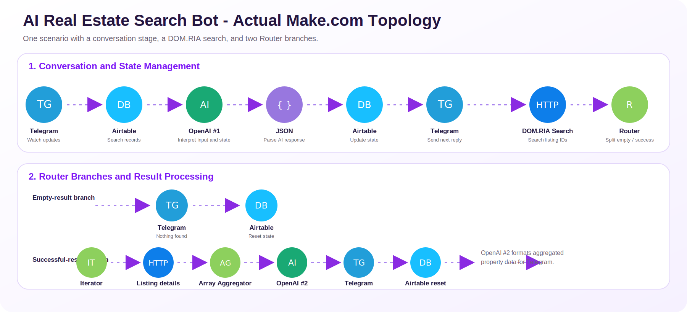

# AI Real Estate Search Bot - Make.com Automation

A stateful AI-powered Telegram bot that collects apartment search criteria, preserves conversation state, queries the DOM.RIA API, and returns formatted property listings.

> Built as a practical AI Automation training project. I configured, tested, and debugged the conversation logic, Airtable persistence, OpenAI prompts, API requests, routing, iteration, aggregation, and Telegram delivery.

## Actual workflow architecture

This is one Make.com scenario with two logical stages and two branches after the Router.

### 1. Conversation and state management

`Telegram Watch Updates -> Airtable Search Records -> OpenAI -> JSON Parse -> Airtable Update Record -> Telegram Reply`

- Telegram receives each new user message.
- Airtable loads the saved state: `step`, `rooms`, `budget_max`, `floor_min`, and `status`.
- The first OpenAI module interprets the answer for the current step and returns structured JSON.
- JSON Parse converts that response into fields Make can map.
- Airtable saves the updated state.
- Telegram sends the next question or confirms that the search has started.

The first OpenAI module does **not** generate a separate search query. It manages the stateful conversation and extracts the value expected at the current step.

### 2. Property search and result processing

`DOM.RIA Search HTTP -> Router`

The search runs only when:

`status = searching AND ready_to_search = true`

#### Empty-result branch

`Telegram notice -> Airtable reset`

#### Successful-result branch

`Iterator -> HTTP listing details -> Array Aggregator -> OpenAI formatter -> Telegram -> Airtable reset`

- The Iterator processes selected listing IDs.
- The second HTTP module retrieves detailed property data.
- Array Aggregator combines the listing responses.
- The second OpenAI module formats the aggregated data into a concise Ukrainian Telegram message.
- Telegram sends the final listings.
- Airtable resets or updates the conversation state.

## Tech stack

- Make.com
- Telegram Bot API
- Airtable
- OpenAI API
- DOM.RIA API
- HTTP and JSON
- Router, Iterator, filters, and Array Aggregator

## Workflow preview

## Corrected LinkedIn carousel

The corrected presentation-ready PDF is attached to the LinkedIn project post.

## Public blueprint

[`blueprint/AI_Real_Estate_Search_Bot_PUBLIC.blueprint.json`](blueprint/AI_Real_Estate_Search_Bot_PUBLIC.blueprint.json)

The public blueprint preserves the real module order, branches, mappings, prompts, state variables, and corrected filters while replacing credentials and private workspace identifiers with placeholders.

Before importing it, configure your own:

- Telegram webhook and connection
- Airtable connection, base, table, and field mappings
- OpenAI connection
- DOM.RIA API key

## Engineering challenges solved

- Preventing repeated conversation steps
- Preventing searches before all required fields were collected
- Distinguishing floor answers from room-count answers
- Synchronizing OpenAI output with Airtable state
- Correctly gating the search with `status = searching` and `ready_to_search = true`
- Routing empty and successful API responses
- Limiting, retrieving, and aggregating property details
- Formatting consistent Telegram-ready output

## Security

This repository excludes live credentials, bot tokens, webhook identifiers, Make connection IDs, private Airtable IDs, and user data. Never commit the original production blueprint or secret files.

## Author

**Dmytro Shefel** - AI Automation Engineer  
[LinkedIn](https://www.linkedin.com/in/dmytro-shefel-3858b3361/)
