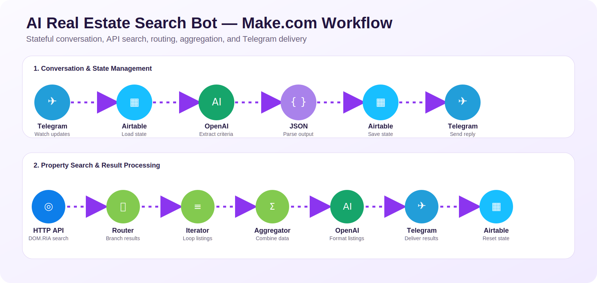

# AI Real Estate Search Bot — Make.com Automation

A stateful AI-powered Telegram bot that collects apartment search criteria, preserves conversation state, queries the DOM.RIA API, and returns formatted property listings.

> Built as a practical AI Automation training project. I configured, tested, and debugged the conversation state logic, Airtable persistence, OpenAI prompts, API requests, routing, iteration, aggregation, and Telegram delivery.

## Architecture

### Conversation and state management

`Telegram → Airtable → OpenAI → JSON Parser → Airtable → Telegram`

- Receives a Telegram message
- Retrieves the user's saved state from Airtable
- Extracts and normalizes rooms, budget, and minimum floor
- Parses structured model output
- Persists the next conversation step
- Sends the next question or starts the search stage

### Property search and result processing

`DOM.RIA API → Router → Iterator → HTTP details → Aggregator → OpenAI → Telegram → Airtable`

- Searches listings using the collected criteria
- Handles successful and empty-result branches
- Retrieves detailed data for selected listings
- Aggregates API responses
- Formats a concise Ukrainian Telegram response
- Resets or updates the stored state

## Tech stack

- Make.com
- Telegram Bot API
- Airtable
- OpenAI API
- DOM.RIA API
- HTTP and JSON
- Routers, iterators, filters, and aggregators

## Workflow preview

## LinkedIn carousel

The presentation-ready PDF carousel is published together with the LinkedIn project post. The repository focuses on the technical architecture and sanitized workflow export.

## Public blueprint

A sanitized portfolio version of the Make.com workflow is available here:

[`blueprint/AI_Real_Estate_Search_Bot_PUBLIC.blueprint.json`](blueprint/AI_Real_Estate_Search_Bot_PUBLIC.blueprint.json)

It preserves the module topology, routing, mappings, state variables, filters, and prompt-driven logic while replacing credentials and private workspace identifiers with placeholders. Before using it, configure your own:

- Telegram webhook and connection
- Airtable connection, base, table, and field mappings
- OpenAI connection
- DOM.RIA API key

## Engineering challenges solved

- Preventing repeated conversation steps
- Preventing searches before all required fields were collected
- Distinguishing floor answers from room-count answers
- Synchronizing model output with Airtable state
- Routing empty and successful API responses
- Limiting, retrieving, and aggregating property details
- Formatting consistent Telegram-ready output

## Security

The repository intentionally excludes live credentials, bot tokens, webhook identifiers, connection IDs, private Airtable IDs, and user data. Never commit the original production blueprint or `.env` files.

## Author

**Dmytro Shefel** — AI Automation Engineer  
[LinkedIn](https://www.linkedin.com/in/dmytro-shefel-3858b3361/)
